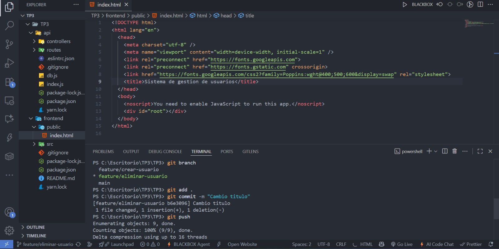
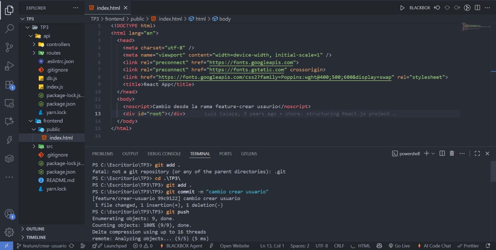
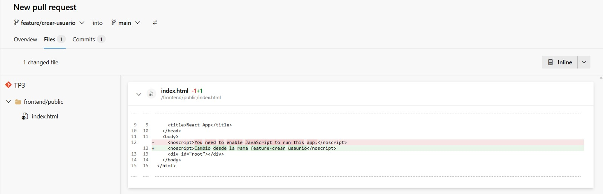
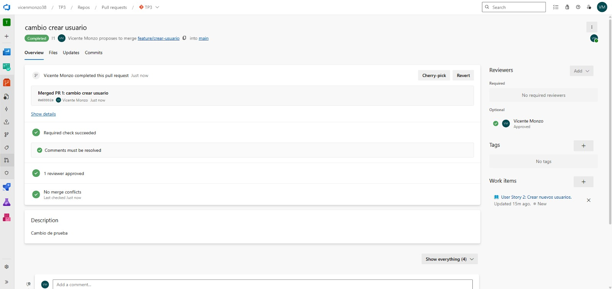

El primer paso fue entrar  Azure Devops y crear una organizacion y un proyecto.
Elegimos la metodología Agile debido a: 
Permite trabajar con sprints cortos (de 2 semanas).
Es más flexible para cambios.
Se adapta bien a equipos chicos (somos 2 personas nada más).
Está alineado con buenas prácticas de sistemas distribuidos y control de versiones

Luego de crear el proyecto elegimos una aplicacion que ya este subida a github para poder importarla y trabajar en base a ese repositorio. Elegimos una api que hace operaciones crud sobre usuarios en node.js + un frontend básico en html.

Link al repositorio:
https://github.com/luizcalaca/node-react-crud-full-stack

En nuestro caso creamos el Epic para gestión de usuarios del sistema, con las 3 users stories con sus 2 task asociadas, quedando de la siguiente manera estructurado:
i. Crear usuario: crear formulario en react e implementar endpoint POST/users en Node.js
ii. Eliminar usuario: crear boton de eliminar usuario e implementar endpoint DELETE/users/:id
iii. Listar/mostrar usuarios: implementar endpoint GET/users y mostrar la lista de usuarios en la interfaz de React.

A su vez simulamos que hay 2 bugs: 
Uno fue asociado a la historia de usuario de mostrar usuarios, siendo que al listar los usuarios no se muestra el último usuario creado
Otro fue asociado a la historia de usuario Eliminar Usuario, cuando al intentar eliminar un usuario inexistente, la API devuelve un error 500 en lugar de un mensaje controlado.

Primero creamos el Epic, las historias de usuario, las task y los bugs, luego fuimos asignando a cada Tarea "Padre" sus tareas "hijas" para organizar jerarquicamente el flujo de trabajo.

También creamos y configuramos sprints de 2 semanas (2 en total) donde en el sprint 01 asignamos las historias de usuario 1 y 2 para crear y eliminar usuario. En el sprint 02 asignamos la tarea de Listar/Mostrar Usuarios
El sprint 1 comenzó el 10/09 y termina el 24/9.
El sprint 2 comienza el 25/9 y termina el 9/10.

Por otro lado creamos 2 equipos de trabajo, dividimos según el área donde se ubicarían los desarrolladores: un equipo para backend y otro para frontend.
Asignamos 1 desarrollador a cada historia de usuario del primer sprint.

Luego importamos el repositorio de github en la parte de Repos y configuramos las políticas de branch que pedía el trabajo: 
Requiere Pull Request para merges y al menos 1 reviewer para confirmar los Pull Request

Después clonamos el repo de Azure en nuestra pc con el comando

https://vicenmonzo38@dev.azure.com/vicenmonzo38/TP3/_git/TP3

Creamos las 2 features que pedía, una para cada historia de usuario a desarrollar en esta sprint 01:
feature/crear-usuario
feature/eliminar-usuario

Hicimos cambios en cada branch y luego pusheamos

Luego de hacer los commits y pushearlos desde nuestra pc, vamos a Azure y creamos las Pull Request desde las features hacia la branch main

Ahora adjunto captura de cuando aprobamos la pull request y los cambios se hicieron en la rama main.

Link de Azure donde está el proyecto:
https://dev.azure.com/vicenmonzo38/TP3
