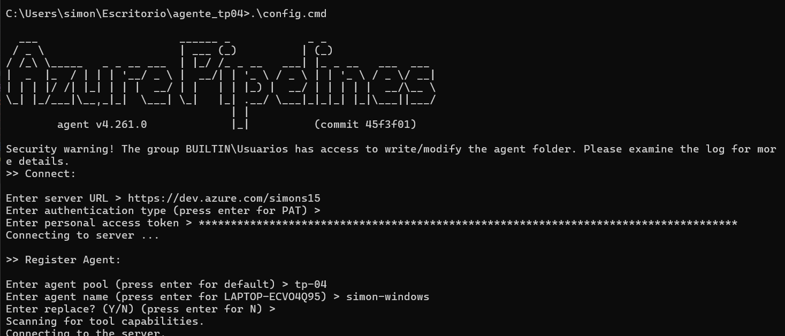

Decisiones del Trabajo Práctico 4 de Ingeniería de Software 3
Alumnos: Barrale Simón y Monzó Vicente

En nuestro caso creamos una app muy básica donde el backend está realizado en Go y el front en React, es para poder crear y eliminar cursos.
El código está subido en el repositorio de Azure en el siguiente link:

https://dev.azure.com/simons15/ejemplo-tp-03

Comenzando con el trabajo que se pedía en las tareas a realizar creamos una Pool en Azure llamada tp_04

Luego creamos un agente (que seria nuestra computadora) con los datos que pedía, tales como organización DevOps, token, y demás.

El repositorio lo organizamos como pedía la consigna en Frontend y Backend por separado y creamos el archivo azure-pipelines.yml en la carpeta raíz.
Dentro del archivo yml usamos comandos como:
trigger: 
   - main
Lo que hace es ejecutar el pipeline automaticamente cada vez que hacemos push a la rama main.

pool:
  name: tp-04
Aqui definimos el pool donde está alojado nuestro agente self-hosted

Luego en los stage tenemos 2 jobs, uno para el frontend y otro para el backend.

 - checkout: self
Lo que hace es clonar el repositorio en el agente para que tenga acceso al código.

Luego la parte de -script: | 
   cd Backend 
   ..
   ..
  displayName: "Compilar Backend" 
Corre un script de shell

Por ultimo queda la parte de publicar el artefacto del pipeline:
-task: PublishBuildArtifacts@1
  inputs:
    PathtoPublish: 'Backend/bin'
    ArtifactName: 'backend'
    publishLocation: 'Container'
Descarga el binario compilado desde Azure DevOps y lo publica.

Captura mostrando la correcta ejecución del pipeline y que se publicaron 2 artefactos, uno para el backend y otro para el frontend 

Tambien adjuntamos captura desde la cmd del agente.

